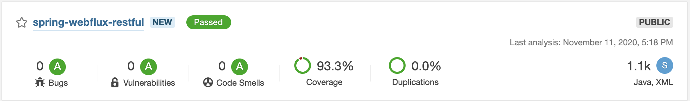

# Spring webflux RESTful
Spring webflux restful build using spring boot webflux and mongodb, this project used to learn reactive programming and code analytic using sonarqube


# Sonarcloud


See 
[sonarcloud dashboard](https://sonarcloud.io/dashboard?id=sukenda_spring-webflux-restful)

# Maven command
- Build skip tests
```
mvn clean install -DskipTests
```

- Build and run test
```
mvn clean install
```

- Build and push image using jib
```
mvn compile jib:build
```

- Build image local
```
mvn compile jib:dockerBuild
```

- Run test using gatling
```
mvn gatling:test
```

# API Spec

## Register account
Request :
- Method : POST
- Endpoint : `/auth/signup`
- Header :
    - Content-Type: application/json
    - Accept: application/json
- Body :

```json 
{
  "username": "string",
  "password": "string",
  "email": "string",
  "profileName": "string",
  "roles": [
    "string"
  ]
}
```
Response :

```json 
{
  "accessToken": "string",
  "refreshToken": "string",
  "user": {
    "id": "string",
    "username": "string",
    "email": "string",
    "profileName": "string",
    "active": true,
    "roles": [
      "string"
    ]
  }
}
```

## Token
Request :
- Method : POST
- Endpoint : `/auth/token`
- Header :
    - Content-Type: application/json
    - Accept: application/json
- Body :

```json
{
  "username": "string",
  "password": "string"
}
```

Response :
```json
{
  "accessToken": "string",
  "refreshToken": "string",
  "user": {
    "id": "string",
    "username": "string",
    "email": "string",
    "profileName": "string",
    "active": "boolean",
    "roles": [
      "string"
    ]
  }
}
```
## Refresh Token
Request :
- Method : POST
- Endpoint : `/auth/refresh-token`
- Header :
    - Content-Type: application/json
    - Accept: application/json
- Body :

```json
{
  "refreshToken": "string"
}
```
Response :

```json
{
  "accessToken": "string",
  "refreshToken": "string",
  "user": {
    "id": "string",
    "username": "string",
    "email": "string",
    "profileName": "string",
    "active": "boolean",
    "roles": [
      "string"
    ]
  }
}
```

## Create Post
Request :
- Method : POST
- Endpoint : `/posts`
- Header :
    - Authorization: Bearer xxxxx
    - Content-Type: application/json
    - Accept: application/json
- Body :

```json
{
  "title": "string",
  "body": "string",
  "comments": [
    {
      "name": "string",
      "body": "string"
    }
  ]
}
```
Response :
```json
{
  "status": "string",
  "code": "number",
  "data": {
    "id": "string",
    "title": "string",
    "body": "string",
    "comments": [
      {
        "name": "string",
        "body": "string"
      }
    ]
  }
}
```
## Get Post
Request :
- Method : GET
- Endpoint : `/posts`
- Header :
    - Authorization: Bearer xxxxx
    - Content-Type: application/json
    - Accept: application/json
    
Response :

```json
{
  "status": "string",
  "code": "number",
  "data": [
    {
      "id": "string",
      "title": "string",
      "body": "string",
      "comments": [
        {
          "name": "string",
          "body": "string"
        }
      ]
    }
  ]
}
```

## Get Post By ID
Request :
- Method : GET
- Endpoint : `/posts/{id}`
- Header :
    - Authorization: Bearer xxxxx
    - Content-Type: application/json
    - Accept: application/json
    
Response :

```json
{
  "status": "string",
  "code": "number",
  "data": {
      "id": "string",
      "title": "string",
      "body": "string",
      "comments": [
        {
          "name": "string",
          "body": "string"
        }
      ]
    }
}
```

## Update Post
Request :
- Method : PUT
- Endpoint : `/posts/{id}`
- Header :
    - Authorization: Bearer xxxxx
    - Content-Type: application/json
    - Accept: application/json
- Body :
```json
{
  "title": "string",
  "body": "string",
  "comments": [
    {
      "name": "string",
      "body": "string"
    }
  ]
}
```

Response :
```json
{
  "status": "string",
  "code": "number",
  "data": {
    "id": "string",
    "title": "string",
    "body": "string",
    "comments": [
      {
        "name": "string",
        "body": "string"
      }
    ]
  }
}
```

## Add Comment
Request :
- Method : PUT
- Endpoint : `/posts/{id}/comment`
- Header :
    - Authorization: Bearer xxxxx
    - Content-Type: application/json
    - Accept: application/json
- Body :
```json
{
  "name": "string",
  "body": "string"
}
```

Response :
```json
{
  "status": "string",
  "code": "number",
  "data": {
    "id": "string",
    "title": "string",
    "body": "string",
    "comments": [
      {
        "name": "string",
        "body": "string"
      }
    ]
  }
}
```

## Delete Post
Request :
- Method : DELETE
- Endpoint : `/posts/{id}`
- Header :
    - Authorization: Bearer xxxxx
    - Accept: application/json

Response :

```json 
{
  "status": "string",
  "code": "number",
  "data": "string"
}
```
